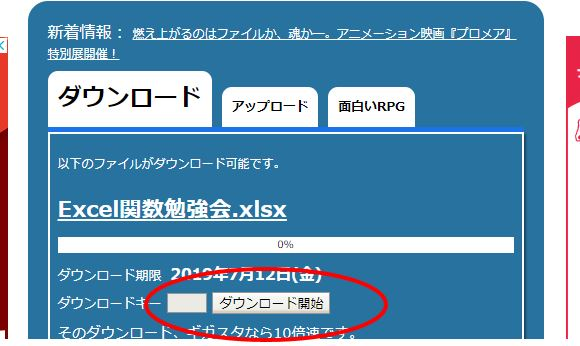
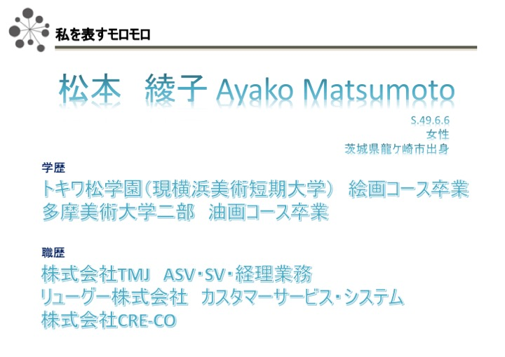
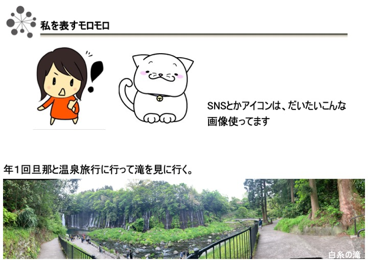
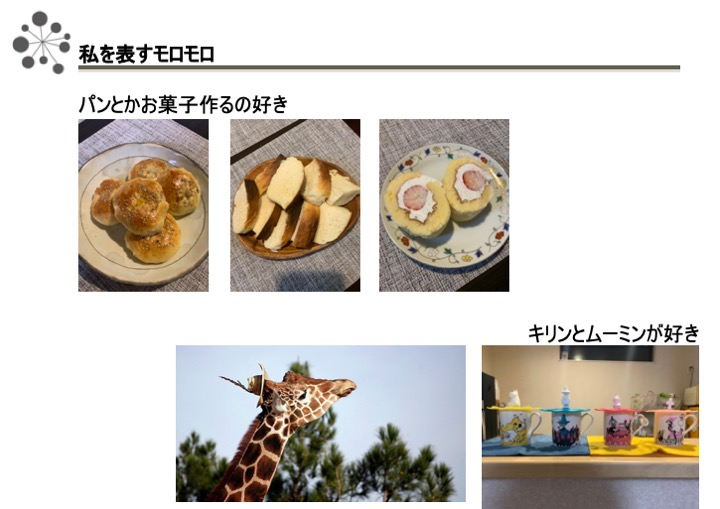
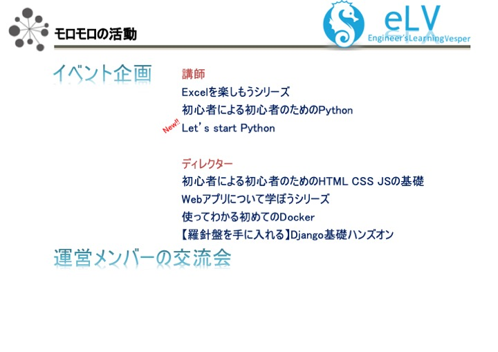
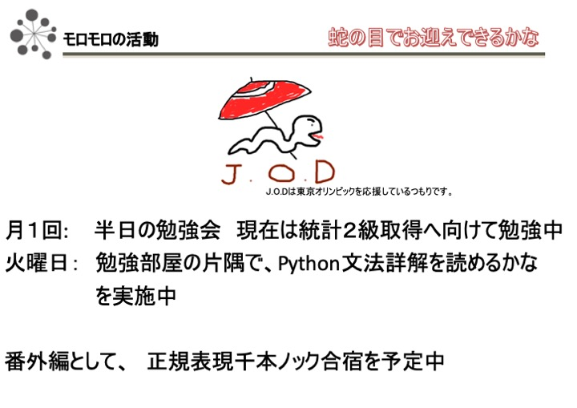
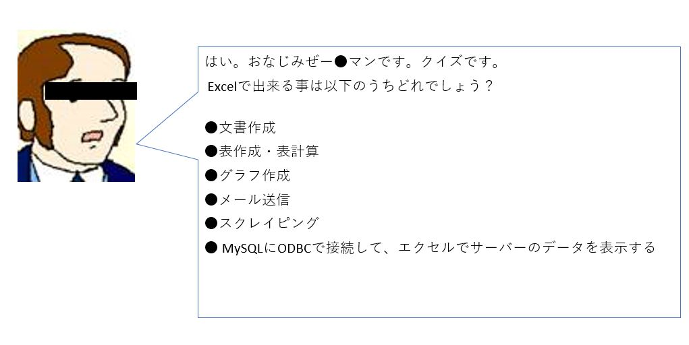
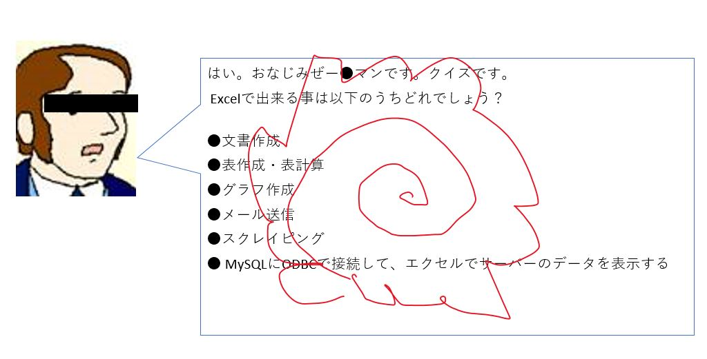

# [今日の資料](http://gf4.work/ZerM)   

+++

# Excelを楽しもう

+++

+++

+++

+++

+++

+++

+++

+++

+++

---

+++

+++

+++

# データ入力  
便利なショートカット

+++
### 日付入力  

ショートカットキー(Windows)
  
本日日付：「Ctrl」+「；」  
現在時刻：「Ctrl」+「：」   

ショートカットキー(Mac)
  
本日日付：「command」+「；」  
現在時刻：「command」+「：」   

+++
### データ編集 

ショートカットキー(Windows)

切り取り：[Ctrl]+[X]  
コピー：[Ctrl]+[C]  
貼り付け：[Ctrl]+[V]  
上の行をうつす：[Ctrl]+[d]   

ショートカットキー(Mac)

切り取り：[command]+[X]  
コピー：[command]+[C]  
貼り付け：[command]+[V]  
上の行をうつす：[command]+[d]       

もっと知りたい方はExcel ショートカット　でグーグル先生に聞いてください。
